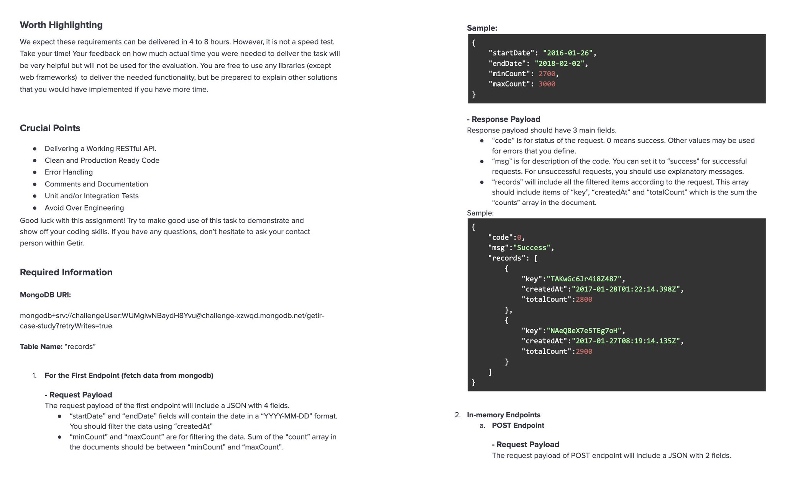
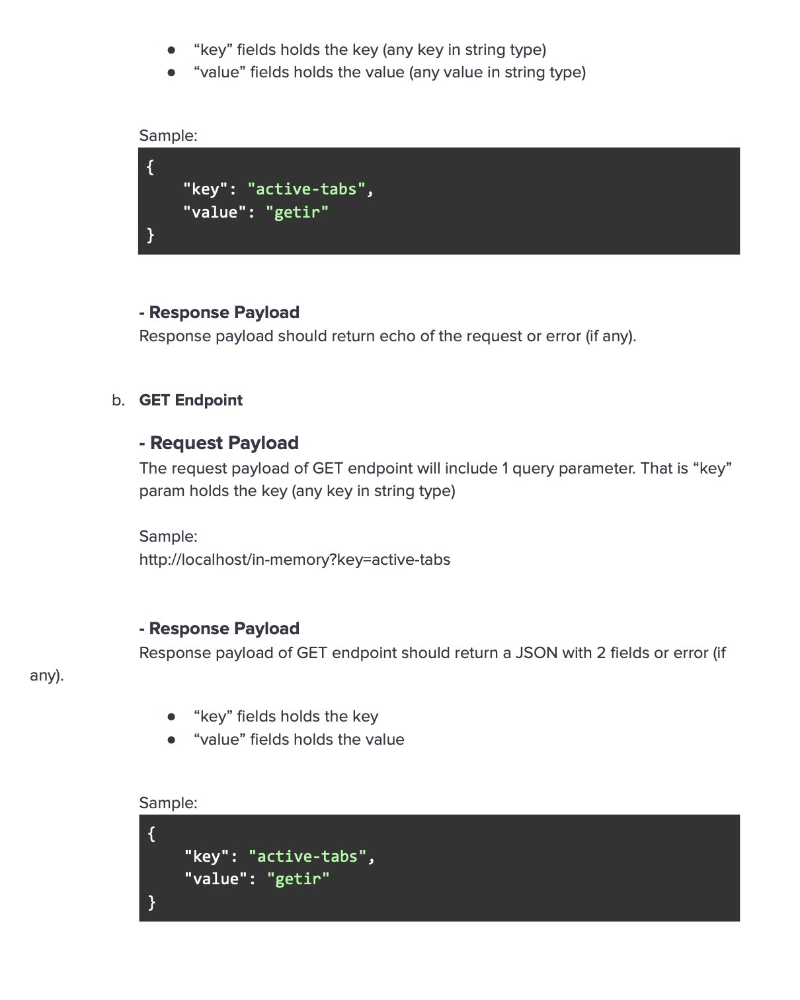

# Go Standard Library REST API Server

## Introduction
This project implements a Go HTTP Server using the standard library. It involves creating a RESTful API with two endpoints, one for fetching data from a provided MongoDB collection and another for Create-Read operations on an in-memory database. 

### Endpoints
- POST /records
  - Gets data from MongoDB collection. Filters are provided through the JSON body: `startDate`, `endDate`,  `minCount`, and `maxCount`.
  - Example filter JSON request
    ```json
    {
        "startDate": "2016-01-26", 
        "endDate": "2018-02-02", 
        "minCount": 2700, 
        "maxCount": 3000
    }
    ```
- GET /in-memory?key=:key
  - Gets value by key from the in-memory storage. A key is needed as a query param.
- POST /in-memory
  - Creates a key-value pair in the in-memory storage. Key and value are provided through the JSON body: `key`, and `value`.
  - Example JSON request
    ```json
    {
        "key": "a key", 
        "value": "some value"
    }
    ```

## Installation
1. Configure env variables
```bash
cp .env.example .env
```
Change listenAddr or the MongoDB URI

2. Build the application's binary 
```bash
make build
```

3. Run the application's binary
```bash
./bin/app
```

## Original Instructions



## Todo
- [ ] Unit Tests


